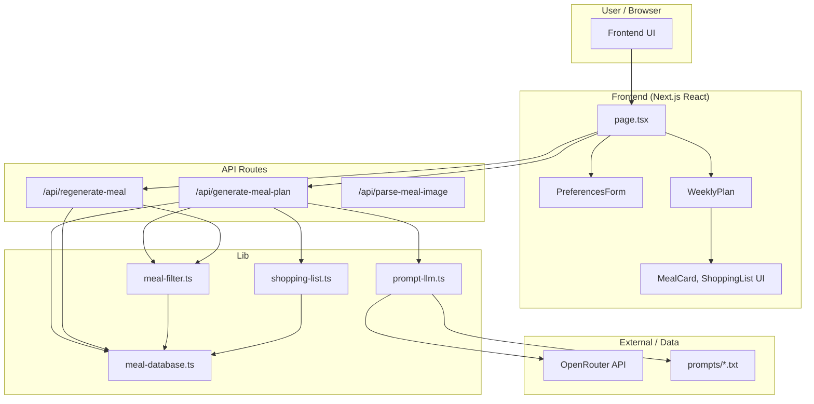

# Fine, I'll Eat — High-Level Architecture

## Diagram (overview)


## System overview (ASCII)

```
┌─────────────────────────────────────────────────────────────────────────────────┐
│                              USER / BROWSER                                       │
└─────────────────────────────────────────────────────────────────────────────────┘
                                          │
                                          ▼
┌─────────────────────────────────────────────────────────────────────────────────┐
│                         FRONTEND (Next.js / React)                                │
│  ┌──────────────┐  ┌──────────────┐  ┌──────────────┐  ┌──────────────────────┐ │
│  │   page.tsx   │  │ Preferences  │  │  WeeklyPlan   │  │ MealCard, Shopping   │ │
│  │  (orchestr.) │  │    Form      │  │  (plan view)  │  │ List UI components   │ │
│  └──────────────┘  └──────────────┘  └──────────────┘  └──────────────────────┘ │
└─────────────────────────────────────────────────────────────────────────────────┘
                                          │
                    POST /api/generate-meal-plan   POST /api/regenerate-meal
                    (preferences)                  (mealType, currentMeal)
                                          │
                                          ▼
┌─────────────────────────────────────────────────────────────────────────────────┐
│                            API ROUTES (Next.js)                                   │
│  ┌─────────────────────────┐  ┌──────────────────┐  ┌─────────────────────────┐  │
│  │ generate-meal-plan      │  │ regenerate-meal  │  │ parse-meal-image        │  │
│  │ • Normalize prefs       │  │ • Select 1 meal  │  │ (image → meal data)     │  │
│  │ • Call LLM or static DB │  │ • Static DB only  │  │                         │  │
│  │ • Build week + list     │  │                  │  │                         │  │
│  └───────────┬─────────────┘  └────────┬─────────┘  └─────────────────────────┘  │
└──────────────┼─────────────────────────┼─────────────────────────────────────────┘
               │                         │
               ▼                         ▼
┌─────────────────────────────────────────────────────────────────────────────────┐
│                              LIB (shared logic)                                   │
│  ┌─────────────────┐  ┌─────────────────┐  ┌─────────────────┐  ┌───────────┐ │
│  │  prompt-llm.ts  │  │  meal-filter.ts  │  │ meal-database.ts│  │ shopping-  │ │
│  │  • Read prompts │  │  • Filter/score  │  │  • MEAL_DATABASE │  │ list.ts    │ │
│  │  • OpenRouter   │  │  • selectMeal   │  │  • coerceToMeal  │  │ • Generate │ │
│  │  • Parse JSON   │  │  • Preferences  │  │  • getMealsByType│  │   list     │ │
│  └────────┬────────┘  └────────┬────────┘  └────────┬────────┘  └─────┬───────┘ │
└───────────┼─────────────────────┼───────────────────┼─────────────────┼─────────┘
            │                     │                   │                 │
            ▼                     └───────────────────┘                 │
┌───────────────────────┐                                                │
│  EXTERNAL / DATA      │                                                │
│  • OpenRouter API     │◄───────────────────────────────────────────────┘
│    (LLM)              │     (Meal[] → ShoppingItem[])
│  • prompts/*.txt      │
│  • outputs/ (local)   │
└───────────────────────┘
```

## Mermaid diagram (render in GitHub, VS Code, or [mermaid.live](https://mermaid.live))



## Data flow (generate meal plan)

1. **User** submits preferences (calories, allergies, cuisines, etc.) and clicks "Launch Weekly Meal Plan".
2. **Frontend** sends `POST /api/generate-meal-plan` with preferences.
3. **API** checks `OPENROUTER_API_KEY`:
   - **If set:** Load prompt from `prompts/generate-weekly-meal-plan.txt`, substitute variables, call **OpenRouter** (LLM), parse JSON → 21 meals, build week + shopping list. Optionally save raw response to `outputs/` (local only).
   - **If unset or LLM fails:** Use **meal-filter** + **meal-database** (static) to select 21 meals, then **shopping-list** to build list.
4. **API** returns `{ plan, shoppingList, usedLlm?, promptUsed?, responseUsed? }`.
5. **Frontend** shows weekly plan and shopping list; if AI was used, shows "Generated with AI" and collapsible prompt/response.

## Key files

| Layer   | File / path              | Role |
|---------|--------------------------|------|
| Frontend| `app/page.tsx`           | State, generate/regenerate handlers, loading & result UI |
| Frontend| `components/preferences-form.tsx` | Preferences form |
| Frontend| `components/weekly-plan.tsx`      | Week view, regenerate buttons |
| API     | `app/api/generate-meal-plan/route.ts` | Full week plan (LLM or static) |
| API     | `app/api/regenerate-meal/route.ts`   | Single meal swap (static) |
| Lib     | `lib/prompt-llm.ts`     | OpenRouter client, prompt load/substitute, JSON parse |
| Lib     | `lib/meal-filter.ts`    | Filter/score by preferences, selectMeal |
| Lib     | `lib/meal-database.ts`  | Static meal list, coerceToMeal |
| Lib     | `lib/shopping-list.ts`  | Build shopping list from meals |
| Data    | `prompts/*.txt`         | Prompt templates (weekly plan, etc.) |
